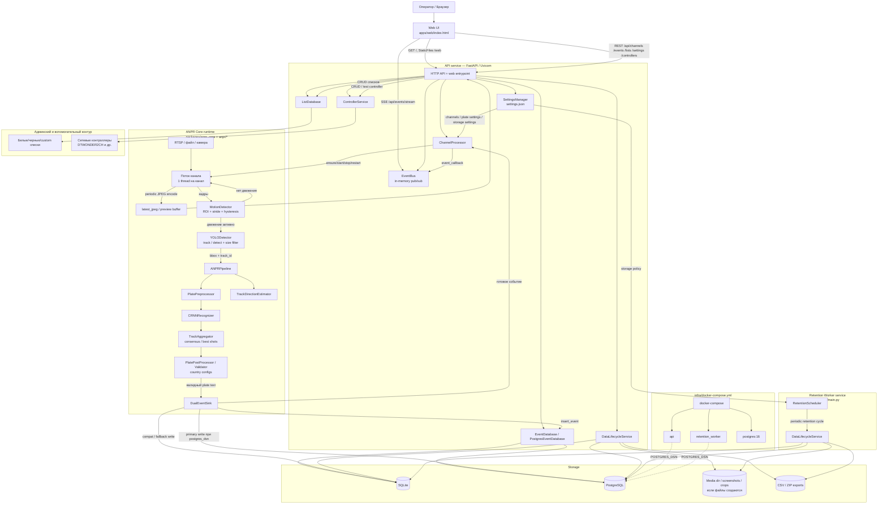

# ANPR System - Automatic Number Plate Recognition


Web-first система автоматического распознавания автомобильных номеров с server-side обработкой многоканального видео, backend API и операторской web-панелью.

## Основные возможности

- **Многоканальная обработка** — независимый runtime для каждого канала
- **Server-side ANPR pipeline** — детекция, OCR, постобработка и сохранение событий выполняются на сервере
- **Web-интерфейс оператора** — просмотр каналов, статусов, событий, ROI и списков
- **Live-события** — поток обновлений через SSE
- **Встроенный live preview** — MJPEG-поток из того же channel runtime (single-ingest-per-channel)
- **Управление каналами** — запуск, остановка, перезапуск и изменение параметров через API
- **ROI и фильтрация** — настройка зоны распознавания и рабочих параметров канала
- **Списки номеров** — белые/черные списки и логика принятия решений
- **Data lifecycle** — retention, очистка, экспорт CSV/ZIP
- **Подготовка к PostgreSQL** — dual-write и миграция из SQLite

## Архитектура

Проект разделён на несколько сервисов:

- **API service** — основной backend, web UI, channel runtime и встроенный preview
- **Worker** — фоновые задачи хранения и retention
- **ANPR Core** — распознавание, OCR, трекинг и обработка событий

Диаграмма взаимодействия (server-side pipeline, web-версия):



## Технологический стек

- **Backend:** FastAPI, Uvicorn
- **Детекция:** YOLOv8
- **OCR:** CRNN
- **Видео:** OpenCV, встроенный MJPEG preview
- **Хранение:** SQLite по умолчанию, PostgreSQL для migration path / dual-write
- **ML stack:** PyTorch 2.8.0, torchvision 0.23.0, torchaudio 2.8.0, ultralytics 8.3.20

## Установка

### Предварительные требования

- Python 3.13
- pip

### Установка зависимостей

```bash
git clone https://github.com/quick-1y/ANPR-System-v0.8_web.git
cd ANPR-System-v0.8_web
```

#### Для CPU:
```bash
pip install -r requirements.txt --index-url https://download.pytorch.org/whl/cpu --extra-index-url https://pypi.org/simple
```

#### Для CUDA 2.8.0:
```bash
pip install torch==2.8.0 torchvision==0.23.0 torchaudio==2.8.0 --index-url https://download.pytorch.org/whl/cu128
```

## Быстрый старт

### Локальный запуск

Откройте три отдельных терминала.

**1. API + Web UI**
```bash
python -m uvicorn apps.api.main:app --host 0.0.0.0 --port 8080
```

**2. Worker**
```bash
python -m uvicorn apps.worker.main:app --host 0.0.0.0 --port 8092
```

### Точки доступа

- **Web UI / API:** `http://localhost:8080`
- **Live preview MJPEG:** `http://localhost:8080/api/channels/{id}/preview.mjpg`
- **Worker health:** `http://localhost:8092/worker/health`

## Docker Compose

```bash
cd infra
docker compose up --build
```

Compose поднимает:

- `api`
- `retention_worker`
- `postgres`


## Диагностика live preview

Система не требует внешнего медиасервера: preview формируется внутри API из того же канального ingest, что и ANPR.

Проверки:

1. `GET /api/channels` — у канала в `metrics` должны быть `state=running` и `preview_ready=true`.
2. `GET /api/channels/{id}/preview/status` — показывает `last_frame_at`, `last_error`.
3. `GET /api/channels/{id}/preview.mjpg` — должен отдавать multipart MJPEG в браузер.
4. `GET /api/channels/{id}/snapshot.jpg` — быстрый снимок из последнего кадра runtime (без нового RTSP-подключения).

Если `preview_ready=false`, UI показывает текст ошибки из `metrics.last_error` вместо ложного статуса live.
В панели «Последние события» на вкладке «Наблюдение» отображаются только события, которые помещаются по высоте блока: новые события добавляются сверху, старые автоматически вытесняются без появления скроллбара.
UI не перезапускает MJPEG-поток предпросмотра при периодическом опросе `/api/channels`: открытый preview-стрим сохраняется стабильным, а обновляются только статус/подписи канала.

## Хранение данных

- **По умолчанию:** SQLite
- **События:** база событий распознавания, метаданные, пути к кадрам и кропам номеров
- **Медиа:** скриншоты и кропы сохраняются на диск
- **Экспорт:** CSV / ZIP через data lifecycle API
- **PostgreSQL:** поддерживается как путь миграции и dual-write, но не является обязательным storage по умолчанию

## Структура проекта

```text
ANPR-System-v0.8_web/
├── apps/
│   ├── api/              # backend API и web entrypoint
│   ├── video_gateway/    # legacy модуль (не обязателен для standalone runtime)
│   ├── worker/           # retention и фоновые задачи
│   └── web/              # операторский web UI
├── packages/
│   └── anpr_core/        # channel runtime, event bus, sinks
├── anpr/                 # detection, OCR, preprocessing, postprocessing, infrastructure
├── infra/
│   ├── docker-compose.yml
│   ├── postgres/
│   ├── nginx/
│   └── k8s/
├── scripts/
│   └── sync_sqlite_to_postgres.py
├── config/
├── models/
├── requirements.txt
└── settings.json
```

## PostgreSQL migration

Если нужен переход на PostgreSQL:

1. Примените схему из `infra/postgres/schema.sql`
2. Синхронизируйте исторические данные через `scripts/sync_sqlite_to_postgres.py`
3. Включите dual-write в настройках storage

## Статус проекта

Текущая версия — **web-only ANPR system**. Desktop UI удалён, основной интерфейс работы теперь веб-панель.

## License

MIT
